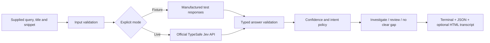

# Jev SERP Opportunity Lab

[](https://github.com/suprkco/jev-serp-opportunity-lab/actions/workflows/ci.yml)

**An inspectable search-intent triage pipeline with a Jev API connector and an offline policy simulator.**

## Problem

Keyword opportunity lists can confuse weak evidence with a guaranteed ranking opportunity.
This lab asks narrow questions about supplied search-result snippets and separates the model's judgment from the code's routing policy.

## Demo

[Open the hosted policy simulation](https://suprkco.github.io/jev-serp-opportunity-lab/) · [Machine-readable simulation](docs/demo/report.json)

Download the repository and open `docs/demo/index.html` locally, or generate a fresh report with the quickstart below. The eight examples and their responses are **manufactured fixtures, not real SERP data or Jev predictions**. The terminal output and static transcript explicitly label simulation mode. No traffic, search-volume, latency or cost claim from a third-party demo is reproduced here.

## Architecture



## Tech stack

Python, httpx, Pydantic, TypeSafe's Jev System One API, static HTML, pytest and GitHub Actions.

## Quickstart

No API key is needed for the default simulation:

```sh
python -m venv .venv
# Activate .venv for your shell, then:
pip install -r requirements.txt -r requirements-dev.txt
python -m serp.cli
```

Results appear directly in the terminal. Use `--json` for machine-readable stdout; `output/report.txt` preserves the plain transcript. `output/index.html` is an optional static transcript, not an interactive terminal. Alternatively, `docker compose up --build` writes the report into its named volume; retrieve it with `docker compose cp demo:/app/output ./output` after the service finishes.

### Live Jev mode

The connector follows the [official TypeSafe API reference](https://docs.typesafe.ai/api), not an independent Jev-branded proxy. Set `TYPESAFE_API_KEY` in your local process environment and optionally pin `JEV_MODEL`. Do not paste the key into a commit, report, browser form or chat. `.env.example` is documentation only; `.env` is not auto-loaded.

```sh
python -m serp.cli --mode live --input data/synthetic_serp.json --max-requests 8 --output output/live
```

Live calls may be billed by your provider. `--max-requests` is an explicit request-count cap, not a dollar budget. There are no automatic retries, and failures never silently switch to simulated answers. Returned model ID, token usage and measured client elapsed time are retained per successful record. No live calls have been made for the committed demo.

Only `query`, `title` and `snippet` are transmitted. Use public or authorized data. Labels used by the simulator are excluded from the API payload. The script does not scrape Google or fetch competitor pages.

## Evaluation

| Check | Observed result |
| --- | --- |
| Local pytest suite | 13 passed |
| Official endpoint/payload/response contract | Tested with mock HTTP transport |
| Missing key and HTTP 429 | Explicit failures |
| Invalid confidence and probability distributions | Rejected |
| Source HTML injection in report | Escaped |
| Live Jev quality, calibration, cost and latency | **Not measured** |

Reproduce with `pytest -q` and `ruff check .`. The lexical-overlap baseline is included per record for inspection; no comparative model-accuracy result is claimed. A proper study needs real annotated examples, a held-out split and live calls with the exact model version recorded.

## Design choices

- **Narrow typed judgments.** A Choice labels intent match; a Noul estimates whether the supplied evidence is too sparse to assess page depth.
- **Code owns the action.** Low confidence and insufficient evidence route to human review. A confident mismatch is only a candidate for investigation, never a promise to outrank a competitor.
- **Probability is validated.** Labels must belong to the rubric, probabilities must be finite and sum to one, and the chosen label must have maximal probability. Provider confidence is not independently calibrated here.
- **Separate simulations from observations.** Every response has provenance; simulated usage and elapsed time are null.
- **Inspect before acting.** Reports preserve the input snippets. No content is generated or published automatically.

## Limitations and next steps

Snippets can be stale, truncated or misleading. Intent judgments do not establish full-page quality, ranking difficulty or search demand. The threshold of 0.8 is illustrative and has not been optimized against expert labels. All sample companies/results are synthetic.

Next: annotate a public, dated SERP dataset; compare lexical and Jev predictions; measure review coverage, false-positive rates and live usage; test a version-pinned model before integration into a production workflow.

Original AI-assisted portfolio implementation by Kilian Codaccioni. Inspired by typed-decision SEO demonstrations; no third-party project code or reported performance is presented as original work. Jev is a TypeSafe product; this repository is not affiliated with TypeSafe. MIT license covers this project's code.
